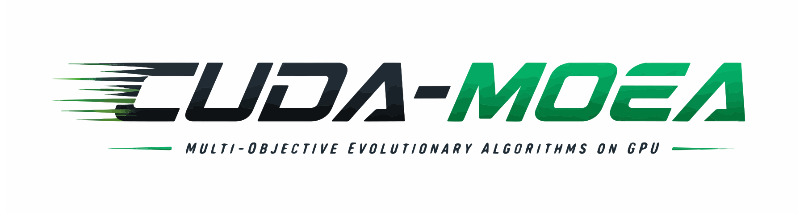
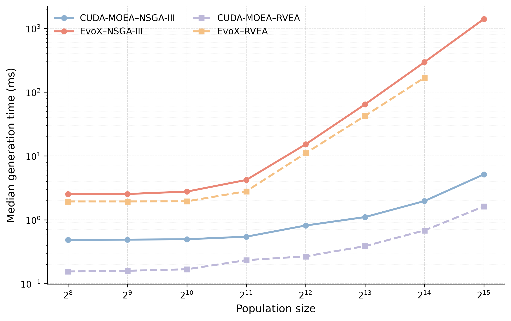
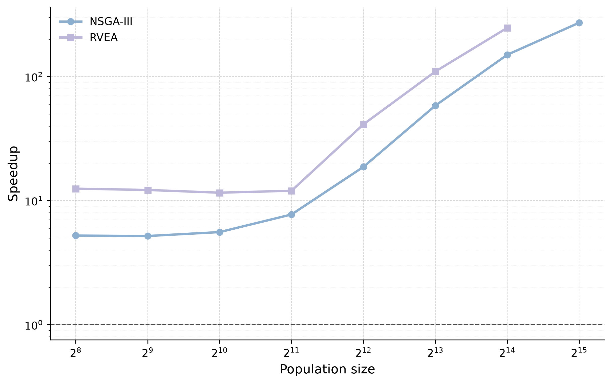
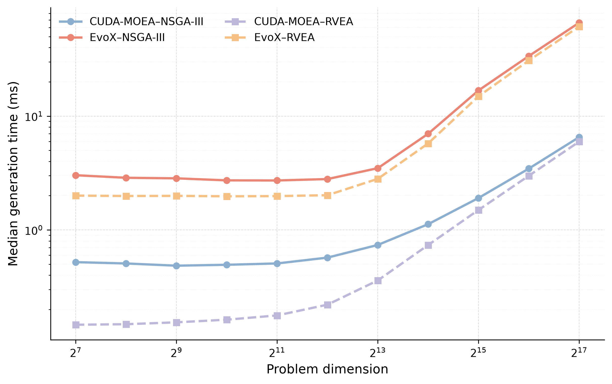
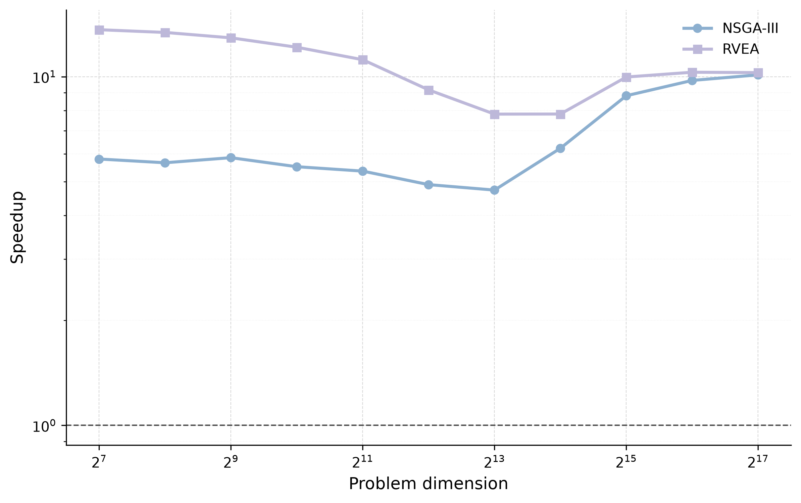

<p align="center">
  
</p>

# CUDA-MOEA

English | [简体中文](README.zh-CN.md)

GPU-accelerated multi-objective evolutionary algorithms for PyTorch.


CUDA-MOEA is a Python/PyTorch package for running multi-objective evolutionary
algorithms (MOEAs) on NVIDIA GPUs. The entire evolutionary loop — problem
evaluation, mating, crossover, mutation, reference-direction maintenance, and
environmental selection — runs as CUDA-native kernels, so population data
never leaves the GPU between generations.

Algorithms are configured through Python. In addition to PyTorch problems,
[native problem extensions](docs/NATIVE_PROBLEMS.md) can implement the original
C++ `IProblemEvaluator` interface and compile independently with caching.
The package includes the extension SDK and shared CUDA core.

We will release the corresponding research article in August 2026.

## Features

- **Algorithms**: NSGA-III and RVEA, through the `NSGA3` / `RVEA` entry
  points or the generic `Algorithm` / `AlgorithmBuilder` interface.
- **CUDA-native pipeline**: every stage of the generation loop is a
  hand-optimized CUDA kernel; inputs and results are `torch.Tensor` objects
  with zero-copy population views.
- **Built-in problems**: DTLZ1–7, ConvexDTLZ2, C1/C2/C3-DTLZ constrained
  variants, and CSDP.
- **Composable operators**: tournament/random mating, simulated binary
  crossover (SBX), polynomial/no mutation, Das-Dennis, adaptive RVEA, and
  user-defined reference directions.
- **PyTorch extensibility**: write custom problems and operators in plain
  PyTorch — including neural-network objectives — and plug them into the GPU
  loop.
- **Full lifecycle control**: run to completion or step generation by
  generation, inspect the live population, and save periodic run snapshots.

## Performance

CUDA-MOEA was benchmarked against [EvoX](https://github.com/EMI-Group/evox)
1.3.0 (CUDA-MOEA 0.1.0, PyTorch 2.12.0, NVIDIA RTX PRO 6000 Blackwell).
Median generation-time speedups on the DTLZ suite:

| Scaling study | NSGA-III | RVEA |
| --- | ---: | ---: |
| Baseline (Group A, 8 problems) | 5.79–12.42× | 12.08–12.73× |
| Population scaling (Group B, largest comparable point) | 271.92× at `N=32768` | 247.26× at `N=16384` |
| Dimension scaling (Group C, `D=131072`) | 10.12× | 10.27× |

At nominal `N=32768`, EvoX RVEA ran out of memory in all 10 repeats while
CUDA-MOEA completed all 10.

Per-generation time (left) and speedup over EvoX (right), under population
scaling (top) and dimension scaling (bottom):

<p> </p>
<p> </p>

Solution quality (IGD) is problem- and algorithm-dependent: neither framework
won everywhere, and these figures must not be extrapolated to untested GPUs,
software stacks, or problems. Timing covers the generation loop after
initialization. The full protocol, statistics, and MoRobtrol control-suite
results are in the [combined benchmark report](tests/benchmark/results/REPORT.md).

## Built-in components

| Category | Components |
| --- | --- |
| Algorithms | `NSGA3`, `RVEA` (plus generic `Algorithm`, `AlgorithmBuilder`) |
| Problems | `DTLZ1`–`DTLZ7`, `ConvexDTLZ2`, `C1DTLZ1`, `C1DTLZ3`, `C2DTLZ2`, `C2ConvexDTLZ2`, `C3DTLZ1`, `C3DTLZ4`, `CSDP` |
| Mating | `TournamentMating`, `RandomMating` |
| Crossover | `SBX` |
| Mutation | `PolynomialMutation`, `NoMutation` |
| Reference directions | `DasDennisDirections`, `AdaptiveRVEADirections`, `UserDefinedDirections` |
| Environmental selection | `NSGA3EnvironmentSelector`, `RVEAEnvironmentSelector` |
| Custom strategies | `PythonProblem`, `PythonMating`, `PythonCrossover`, `PythonMutation`, `PythonReferenceDirections`, `PythonEnvironmentSelector` |

## Requirements

- Python 3.9 or later
- A CUDA-enabled build of PyTorch 2.1 or later
- CUDA Toolkit (12.8 or later is recommended)
- CMake 3.24 or later
- A host compiler compatible with the selected PyTorch/CUDA toolchain
- OpenMP
- An NVIDIA GPU supported by that toolchain

PyTorch, the CUDA Toolkit, and the host compiler must be ABI-compatible. The
repository does not currently define a tested operating-system matrix.

## Installation

Install the latest release from PyPI:

```bash
python -m pip install cuda-moea
```

PyPI serves the source archive; pip compiles the extension with your local
toolchain, which requires the environment listed under
[Requirements](#requirements). Pre-built wheels for Linux x86_64, CPython
3.11, and PyTorch built for CUDA 12.8 (compute capabilities 80, 86, 89, 90,
100, and 120) are attached to
[GitHub Releases](https://github.com/youben917/CUDA-MOEA/releases) for
environments that match that stack exactly.

### Install from a source checkout

From the repository root, in an environment that already contains a
CUDA-enabled PyTorch installation, run:

```bash
CMAKE_CUDA_ARCHITECTURES=89 TORCH_CUDA_ARCH_LIST=8.9 \
  python -m pip install . --no-build-isolation
```

Replace `89` and `8.9` with the compute capability of the target GPU. Common
values:

| `CMAKE_CUDA_ARCHITECTURES` | Representative GPUs |
| ---: | --- |
| 80 | A100 |
| 86 | RTX 30 series |
| 89 | RTX 40 series |
| 90 | H100 / H200 |
| 100 | B100 / B200 |
| 120 | RTX 50 series, RTX PRO 6000 Blackwell |

For an editable development installation, replace `install .` with
`install -e .`.

## Quick start

```python
import cuda_moea as cm

algorithm = cm.NSGA3(
    population_size=1024,
    max_generations=500,
    problem=cm.DTLZ2(dimension=12, objectives=3),
    device="cuda:0",
    seed=2887,
)

result = algorithm.run(copy=True)
print(result.variables.shape)    # torch.Size([1024, 12])
print(result.objectives.shape)   # torch.Size([1024, 3])
print(result.constraints.shape)  # torch.Size([1024])
```

To control the lifecycle one generation at a time:

```python
algorithm.initialize()
while not algorithm.finished:
    algorithm.step()
result = algorithm.result()
```

Custom problems are plain PyTorch. Any `torch` computation works inside
`evaluate`, including neural networks:

```python
import torch
import cuda_moea as cm

class MyProblem(cm.PythonProblem):
    def __init__(self):
        super().__init__(dimension=32, objectives=3,
                         lower_bounds=-1.0, upper_bounds=1.0)

    def evaluate(self, x, context):
        # x: (N, 32) CUDA tensor -> objectives: (N, 3) CUDA tensor
        return torch.stack([(x ** 2).sum(dim=1),
                            ((x - 0.5) ** 2).sum(dim=1),
                            ((x + 0.5) ** 2).sum(dim=1)], dim=1)

algorithm = cm.NSGA3(
    population_size=4096,
    max_generations=500,
    problem=MyProblem(),
    device="cuda:0",
)
result = algorithm.run()
```

## Examples

Runnable programs in [`examples/`](examples/):

- [`nsga3_torch.py`](examples/nsga3_torch.py) — NSGA-III on 500-variable
  DTLZ1 with a 16384-strong population and periodic snapshots.
- [`rvea_torch.py`](examples/rvea_torch.py) — RVEA on the constrained CSDP
  problem through the generic `Algorithm` entry point.
- [`python_example.py`](examples/python_example.py) — a fully custom setup:
  neural-network objective plus user-defined mating, crossover, mutation, and
  reference directions.

## Documentation

- [Python/PyTorch API reference](docs/API.md)
- [Development and packaging guide](docs/DEVELOPMENT.md)
- [Pre-release checklist](docs/RELEASE_CHECKLIST.md)
- [Evaluation guide](tests/evaluation/README.md)
- [Benchmark execution guide](tests/benchmark/README.md)
- [Benchmark protocol](tests/benchmark/TEST_PLAN.md)
- [Combined benchmark report](tests/benchmark/results/REPORT.md)
- [DTLZ report](tests/benchmark/DTLZ/results/REPORT.md)
- [MoRobtrol report](tests/benchmark/MoRobtrol/results/REPORT.md)

## Test

After installing the package, run the Python test suite from the repository
root:

```bash
python -m unittest discover -s tests/python -v
```

CUDA-dependent API tests are skipped when CUDA is unavailable. Benchmark runs
have additional dependencies and substantially higher hardware and time costs;
follow the dedicated [benchmark guide](tests/benchmark/README.md).

## Repository layout

```text
CUDA-MOEA/
├── docs/                 # API, development, and release documentation
├── examples/             # Python examples
├── python/
│   ├── cuda_moea/        # Public Python package
│   └── csrc/             # Private native CUDA extension
├── tests/                # Unit, evaluation, and benchmark suites
├── CMakeLists.txt        # Native build configuration
├── pyproject.toml        # Python package metadata
└── setup.py              # CMake-backed extension build
```

## Release status

The package metadata identifies the current version as `0.2.0`. Pushing a
`v<version>` tag runs the automated release workflow in
`.github/workflows/publish.yml`: version-consistency check, tests, sdist and
Linux CUDA wheel builds, PyPI upload through trusted publishing, and the
GitHub Release. This checkout does not yet state a support/security channel.

## License

CUDA-MOEA is licensed under the [MIT License](LICENSE).
