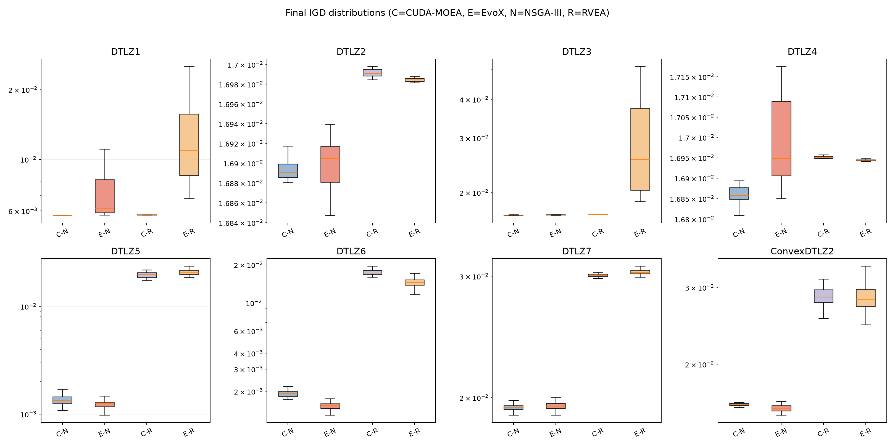
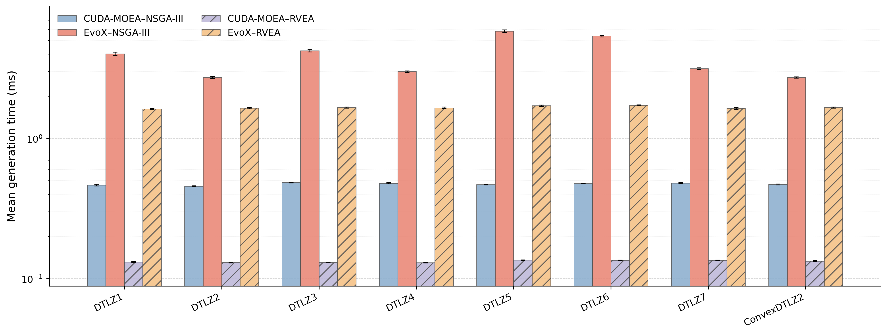
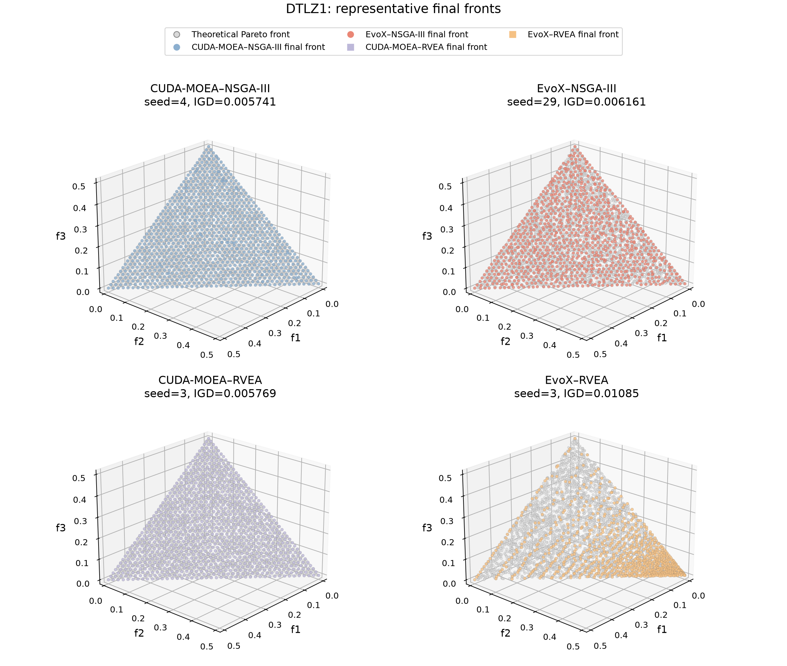
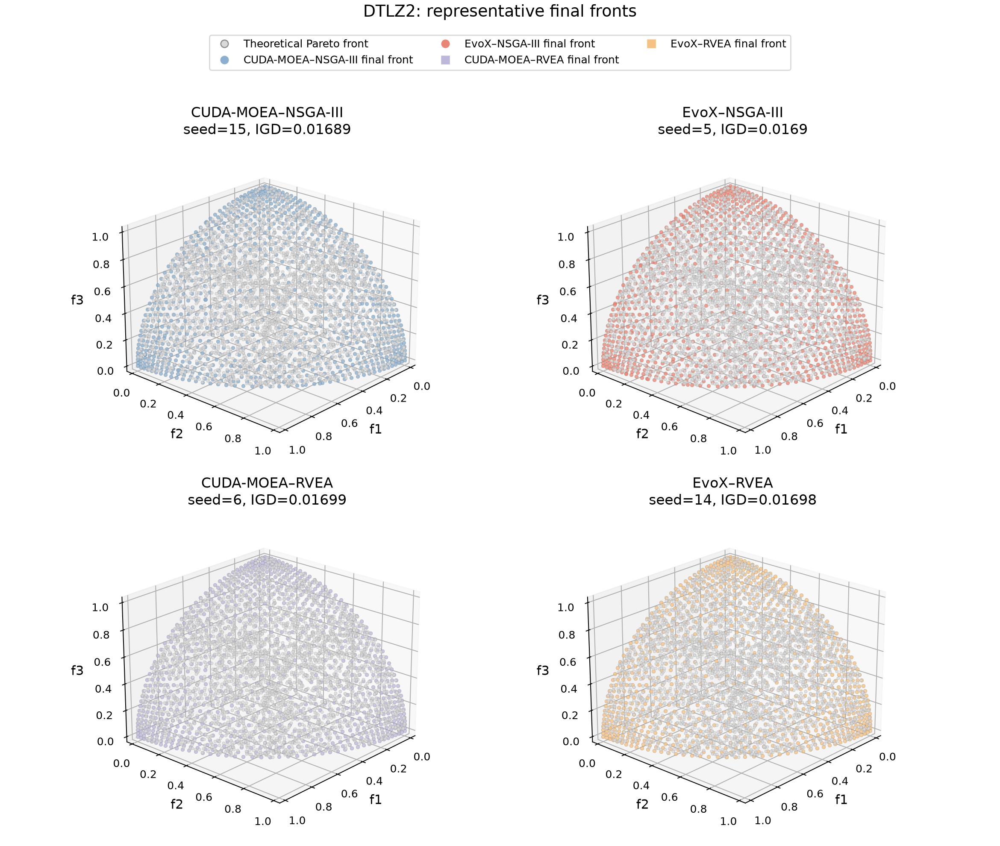
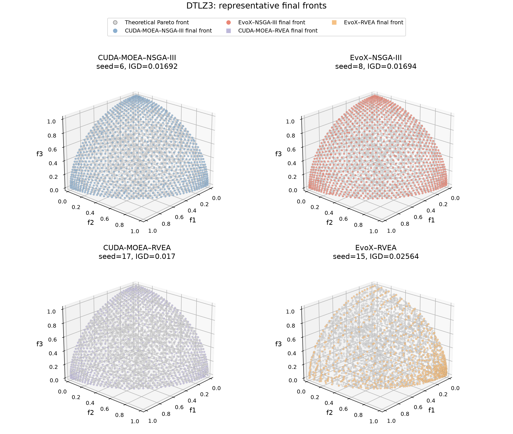
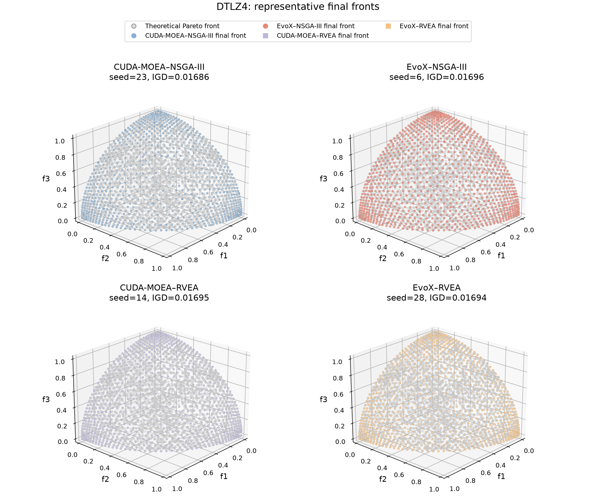
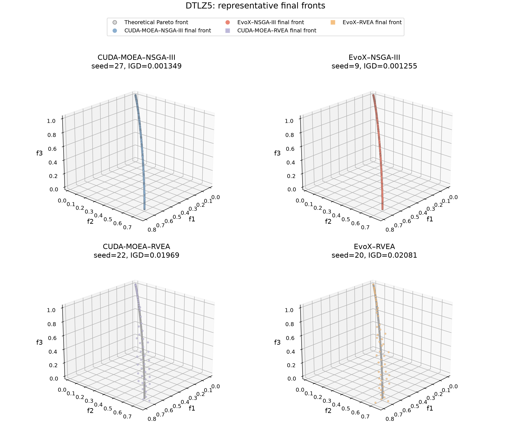
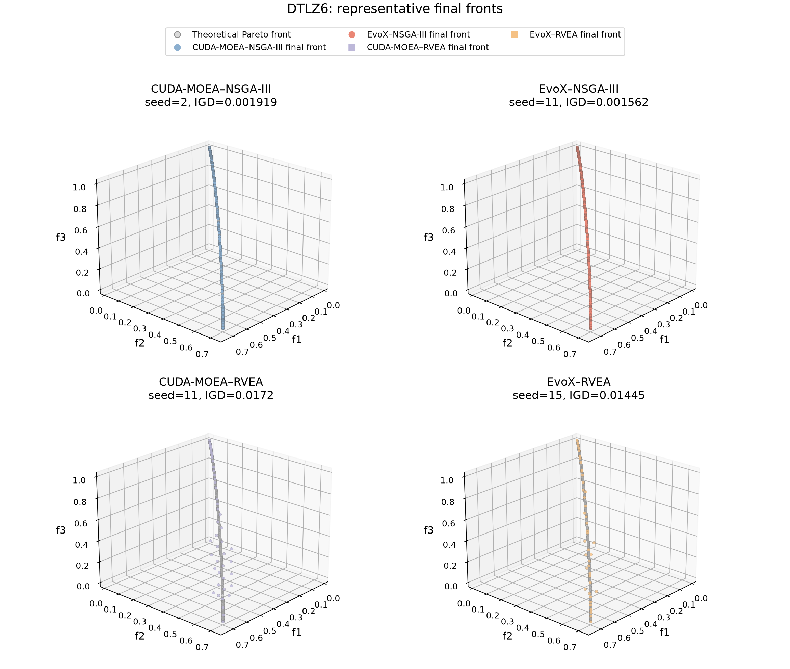
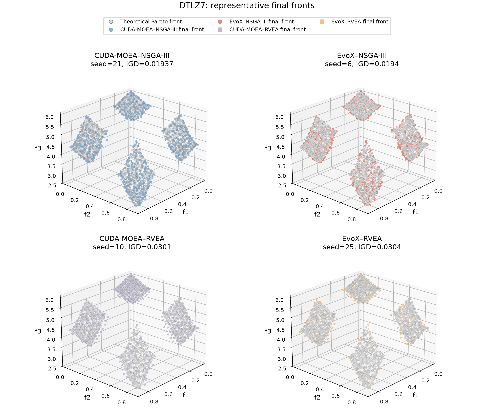
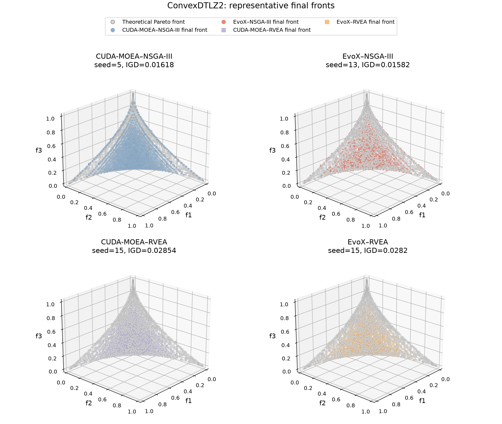

# CUDA-MOEA vs. EvoX: DTLZ Groups A/B/C

English | [简体中文](REPORT.zh-CN.md)

Source dataset: `output/benchmark_20260710/data/raw_runs.json`. The committed
CSV files and figures were derived offline from that dataset and were not part
of algorithm timing.

## Data integrity and environment

- Group A: 960/960 successful runs.
- Group B: 310/320 successful runs; EvoX RVEA was OOM in all 10 repeats at
  nominal `N=32768` while CUDA-MOEA completed all 10.
- Group C: 440/440 successful runs.
- Baseline revision: `2dc367fda14d5b2860e57ad5d0a6a6e2e7d32088`.
- Device: `cuda:1`, NVIDIA RTX PRO 6000 Blackwell Workstation Edition,
  driver 580.126.09, 97887 MiB.
- Software: CUDA-MOEA 0.1.0, EvoX 1.3.0, PyTorch 2.12.0.

IGD is lower-is-better. Speedup is
`median(EvoX) / median(CUDA-MOEA)` for the same algorithm and actual
population. Failed points are retained and are never replaced by zero timing.

## Group A: quality and baseline timing

Thirty independent seeds contribute to every problem/framework/algorithm cell.
Exact mean/std, median/IQR, timing, and test statistics are in
[`quality_summary.csv`](data/quality_summary.csv) and
[`quality_rank_sum_tests.csv`](data/quality_rank_sum_tests.csv).

| Algorithm | CUDA lower median IGD | EvoX lower median IGD | CUDA significantly lower | EvoX significantly lower | Not significant |
| --- | ---: | ---: | ---: | ---: | ---: |
| NSGA-III | 5/8 | 3/8 | 2/8 | 3/8 | 3/8 |
| RVEA | 4/8 | 4/8 | 4/8 | 3/8 | 1/8 |

CUDA-MOEA's NSGA-III advantage was significant on DTLZ1 and DTLZ4. EvoX's was
significant on DTLZ5, DTLZ6, and ConvexDTLZ2. For RVEA, CUDA-MOEA was
significantly better on DTLZ1, DTLZ3, DTLZ5, and DTLZ7; EvoX was significantly
better on DTLZ2, DTLZ4, and DTLZ6. ConvexDTLZ2 was not significant.

CUDA-MOEA was faster for every Group A problem within the same algorithm:
5.79–12.42× for NSGA-III and 12.08–12.73× for RVEA.

Representative fronts select the seed whose IGD is closest to the 30-seed
median, never the best seed:

 

 

 

 

## Group B: population scaling

| Algorithm | Smallest point | Largest comparable point | Largest speedup | Endpoint status |
| --- | ---: | ---: | ---: | --- |
| NSGA-III | 5.23× at `N=256` | `N=32768` | 271.92× | Both frameworks 10/10 |
| RVEA | 12.49× at `N=256` | `N=16384` | 247.26× | At `N=32768`: CUDA 10/10, EvoX 0/10 OOM |

 

Exact medians, success/failure counts, and 10,000-resample bootstrap confidence
intervals are in [`population_timing_summary.csv`](data/population_timing_summary.csv).

## Group C: decision-dimension scaling

| Algorithm | Minimum speedup | Speedup at `D=131072` | Result across tested dimensions |
| --- | ---: | ---: | --- |
| NSGA-III | 4.73× at `D=8192` | 10.12× | CUDA-MOEA faster at all points |
| RVEA | 7.81× at `D=8192` | 10.27× | CUDA-MOEA faster at all points |

 

The relative advantage narrows at intermediate dimensions and grows again when
high-dimensional computation dominates. Exact values and confidence intervals
are in [`dimension_timing_summary.csv`](data/dimension_timing_summary.csv).

## Derived-data index

| File | Purpose |
| --- | --- |
| [`quality_runs.csv`](data/quality_runs.csv) | Per-run objectives, non-dominated counts, and IGD |
| [`quality_summary.csv`](data/quality_summary.csv) | Group A descriptive statistics |
| [`quality_rank_sum_tests.csv`](data/quality_rank_sum_tests.csv) | Rank-sum tests, Holm correction, and effect sizes |
| [`pareto_front_sensitivity.csv`](data/pareto_front_sensitivity.csv) | 20k/50k reference-front sensitivity |
| [`representative_runs.csv`](data/representative_runs.csv) | Median-IGD representative seeds and paths |
| [`population_timing_summary.csv`](data/population_timing_summary.csv) | Group B medians, confidence intervals, and statuses |
| [`dimension_timing_summary.csv`](data/dimension_timing_summary.csv) | Group C medians and confidence intervals |

These results apply only to the recorded environment and matrix. They do not
establish performance or quality on other hardware, versions, or problems.
