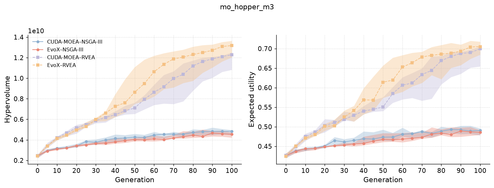
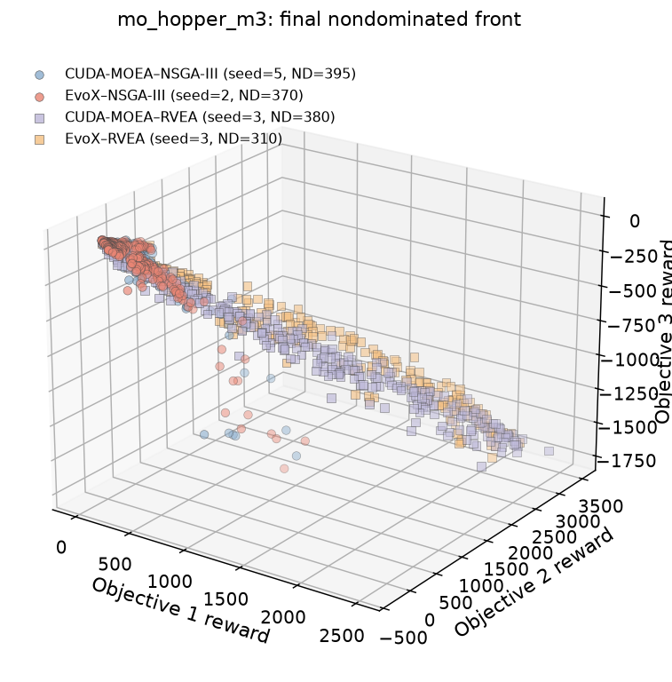
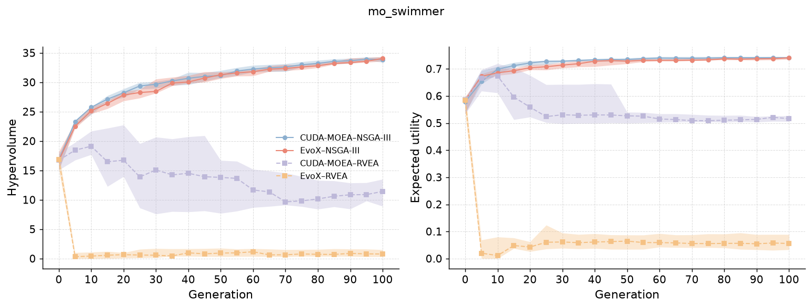
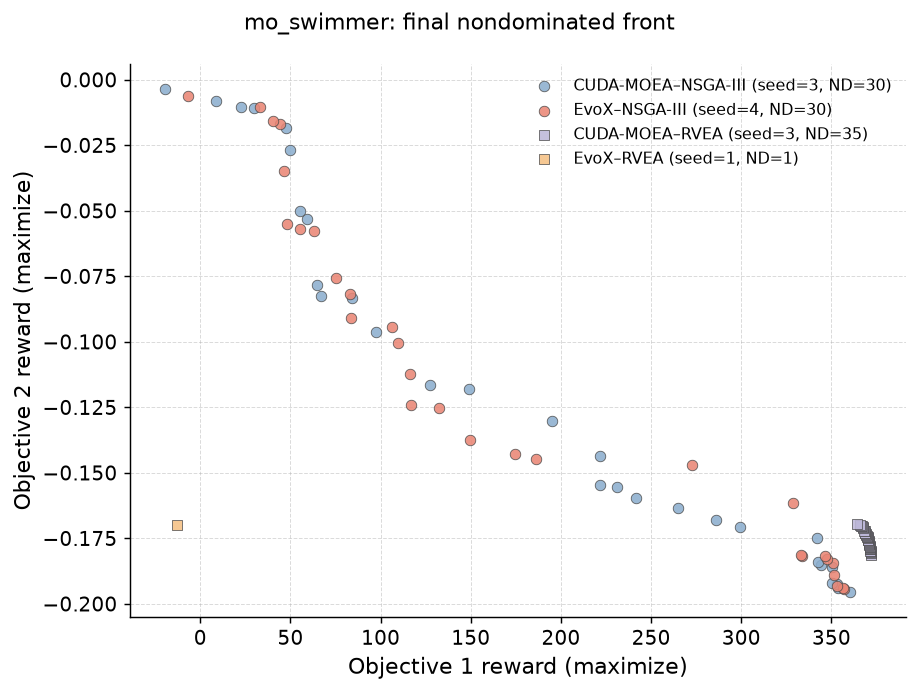

# MoRobtrol Group D Quality Report

English | [简体中文](REPORT.zh-CN.md)

Generated: 2026-07-15  
Completed scope: `mo_hopper_m3` and `mo_swimmer`; CUDA-MOEA and EvoX;
NSGA-III and RVEA; 10 seeds per cell; nominal population 16384; generations
0–100 with five-generation checkpoints.

This is a partial Group D report: two of the nine environments in the protocol
have completed derived results.

## Summary

- Hopper / NSGA-III: CUDA-MOEA finished with higher median HV and EU and lower
  median algorithm time. It also led at common 2.93, 5.85, and 8.75 minute
  budgets.
- Hopper / RVEA: CUDA-MOEA led at the early 2.87 minute budget, but EvoX had
  higher late and final quality. Their final algorithm times were close.
- Swimmer / NSGA-III: final quality was nearly equal, while CUDA-MOEA used
  substantially less algorithm time and had higher quality at common budgets.
- Swimmer / RVEA: CUDA-MOEA had much higher final and equal-time quality with
  similar final algorithm time.

| Environment / algorithm | CUDA final HV / EU | EvoX final HV / EU | Median 100-generation time, CUDA / EvoX |
| --- | ---: | ---: | ---: |
| Hopper / NSGA-III | 4.846e9 / 0.4906 | 4.538e9 / 0.4856 | 9.99 / 11.65 min |
| Hopper / RVEA | 1.229e10 / 0.6995 | 1.318e10 / 0.7051 | 11.17 / 11.46 min |
| Swimmer / NSGA-III | 33.87 / 0.74095 | 34.06 / 0.74092 | 11.59 / 19.19 min |
| Swimmer / RVEA | 11.43 / 0.5163 | 0.7765 / 0.05566 | 11.57 / 11.83 min |

## Interpretation rules

- Curves summarize 10 seeds by median and IQR; higher HV and EU are better.
- Time is cumulative algorithm checkpoint time. It excludes independent
  evaluation, metric calculation, checkpoint I/O, and plotting.
- Optimization time includes policy evaluation in the simulator. This shared
  cost can dilute differences in evolutionary-operator throughput.
- Quality-at-time uses only the common observed time horizon.
- Time-to-target uses the final EvoX median and an optional 90% threshold.
  Statistics cover only seeds that reach the target within 100 generations.
- A zero-minute target time means the target was met at generation 0; it is not
  infinite speedup.
- Representative final fronts use the run closest to median final HV.

## Hopper

For NSGA-III, CUDA-MOEA's median HV was 9.5%, 7.4%, and 13.3% higher at the
three common early/mid/late budgets; EU was 3.4%, 2.0%, and 3.8% higher. It
reached the final EvoX median HV/EU in 90%/80% of seeds versus 70%/60% for EvoX.

For RVEA, CUDA-MOEA led at 2.87 minutes (HV +5.7%, EU +2.0%). EvoX led at 5.73
and 8.59 minutes, with HV +13.5%/+14.7% and EU +7.0%/+5.4%. CUDA-MOEA did not
reach EvoX's final median HV in any seed, so its slightly lower final time is not
an equal-quality speedup.

## Swimmer

For NSGA-III, CUDA-MOEA's median HV was 10.1% and 7.7% higher at common 4.84
and 9.64 minute budgets; EU was 4.3% and 1.7% higher.

For RVEA, CUDA-MOEA's median HV was 26.6×, 17.2×, and 15.1× EvoX at common
2.96, 5.92, and 8.88 minute budgets. EU was 9.4×, 8.3×, and 9.1×. Some
EvoX-derived targets were already met at generation 0 and are not useful for
speedup interpretation.

## Exact data and reproduction

- [`checkpoint_metric_summary.csv`](data/checkpoint_metric_summary.csv) contains
  generation/time HV and EU summaries.
- [`quality_at_time.csv`](data/quality_at_time.csv) contains common-budget
  comparisons.
- [`time_to_target.csv`](data/time_to_target.csv) contains reach rates,
  censoring, and reached-seed times.
- [`metric_references.json`](data/metric_references.json) freezes HV/EU
  reference data.

The figures originate from saved outputs in
[`plot_quality_curves.ipynb`](../plot_quality_curves.ipynb). Re-running the
current Chinese report generator refreshes `REPORT.zh-CN.md`; update this
English summary from the regenerated CSV files before release.
