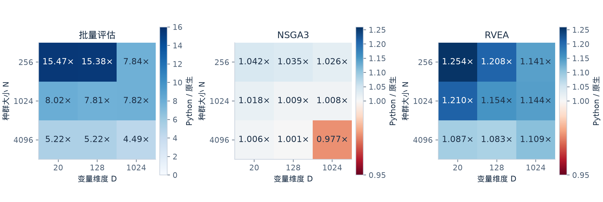
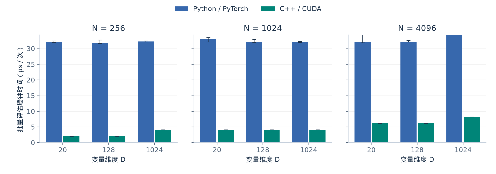
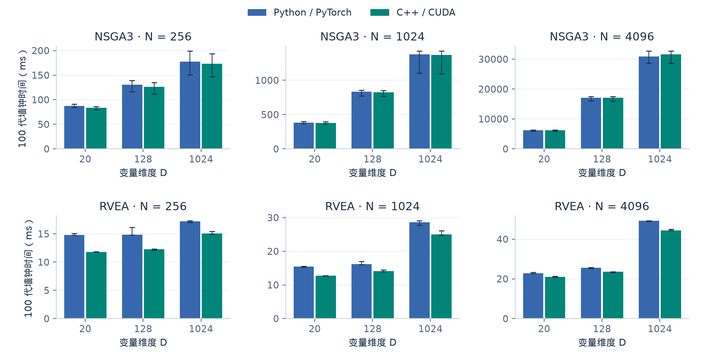

# Python/PyTorch 与原生 C++/CUDA 自定义问题性能实测

测试开始：`2026-09-11T04:04:55.847969+00:00`；完成：`2026-09-11T04:18:52.205350+00:00`。

本次测试使用同一约束 BiSphere 问题，批量评估加速比为 **4.49–15.47×**。
NSGA3 完整代循环加速比为 **0.98–1.04×**。
RVEA 完整代循环加速比为 **1.08–1.25×**。

加速比统一为 Python 耗时 / 原生耗时；大于 1 表示原生实现更快，小于 1 表示本次测量原生更慢。



图 1：每格为 Python 与原生耗时中位数之比；N 为种群大小，D 为变量维度。评估与完整优化使用不同色标，两个优化算法共用色标。小于 1 的格子表示原生更慢。

## 环境与口径

- GPU：NVIDIA RTX PRO 6000 Blackwell Workstation Edition，物理 GPU `1`，计算能力 `[12, 0]`。
- PyTorch：`2.11.0+cu128`；CUDA：`12.8`；编译目标：`120`。
- 核心 SDK 构建标识：`9e6742cbc013095f868985e32dfbaadd80f6ad52e01be1778ad6dae77ad0c63b`。
- 种群：`[256, 1024, 4096]`；维度：`[20, 128, 1024]`；两个目标。
- 目标：`f1=sum(x²)`、`f2=sum((x-2)²)`；约束违反量：`max(f1-9, 0)`；边界 `[-5,5]`。
- PyTorch 基线使用批量 eager 算子；原生版本使用单个融合 CUDA kernel，每个个体由一个 128 线程 block 处理。
- 评估：每个样本预热 50 次，然后连续评估 500 次，取平均单次墙钟时间；共 7 个样本，表中列中位数。
- 完整优化：每个算法先预热，然后用相同初始种群和配对随机种子运行 100 代，共 7 次，表中列中位数。
- 两种实现交替随机测试顺序；完整优化计时排除编译、构造、初始化和数据写盘，包含代循环、最终同步和零拷贝结果包装。
- 评估计时包含 Python 回调、Tensor 适配、GPU 算子及结果复制。它衡量完整评估路径，不单独估计 Python 回调本身。
- NSGA-III 设置 `sparse_ratio=1.0`，为支配关系分配完整容量，避免默认稀疏容量溢出使结果近似。
- GPU 时钟未锁定；CSV 保留最小/最大值，微小差异不应直接视为稳定优势。

## 数值验证

每个规模的两种实现均先对相同输入进行评估，与 float64 公式参考比较；输入包含可行点、边界点和不可行点。
容差为 `rtol=2e-5, atol=2e-4`。所有已记录配置通过验证。
目标值最大缩放误差 `abs(error)/max(abs(reference),1)` 为 `1.628e-07`。
GPU 单元测试另覆盖非默认 stream、reset 和结果生命周期。完整进化轨迹未要求逐位一致：浮点归约顺序差异可能影响选择与最终种群。

## 批量评估



图 2：柱高为 7 个样本的中位数，误差线为实测最小值至最大值，不是置信区间。每个样本是连续 500 次评估的平均单次耗时；三个面板共用纵轴。


单位：μs / 次；每次评估整个种群。

| N | D | Python/PyTorch | C++/CUDA | 加速比 |
|---:|---:|---:|---:|---:|
| 256 | 20 | 32.04 | 2.07 | 15.47× |
| 256 | 128 | 31.87 | 2.07 | 15.38× |
| 256 | 1024 | 32.27 | 4.12 | 7.84× |
| 1024 | 20 | 33.00 | 4.11 | 8.02× |
| 1024 | 128 | 32.15 | 4.12 | 7.81× |
| 1024 | 1024 | 32.23 | 4.12 | 7.82× |
| 4096 | 20 | 32.17 | 6.17 | 5.22× |
| 4096 | 128 | 32.23 | 6.17 | 5.22× |
| 4096 | 1024 | 36.90 | 8.21 | 4.49× |

## 完整优化



图 3：100 代墙钟时间；柱高为 7 次运行的中位数，误差线为实测最小值至最大值，不是置信区间。各面板纵轴独立，均从零开始；请按刻度比较绝对耗时。编译、构造与初始化不计入。


单位：ms / 100 代。

| 算法 | N | D | Python/PyTorch | C++/CUDA | 加速比 |
|---|---:|---:|---:|---:|---:|
| NSGA3 | 256 | 20 | 87.11 | 83.59 | 1.04× |
| RVEA | 256 | 20 | 14.79 | 11.79 | 1.25× |
| NSGA3 | 256 | 128 | 130.65 | 126.25 | 1.03× |
| RVEA | 256 | 128 | 14.84 | 12.29 | 1.21× |
| NSGA3 | 256 | 1024 | 177.67 | 173.20 | 1.03× |
| RVEA | 256 | 1024 | 17.21 | 15.08 | 1.14× |
| NSGA3 | 1024 | 20 | 383.07 | 376.18 | 1.02× |
| RVEA | 1024 | 20 | 15.41 | 12.74 | 1.21× |
| NSGA3 | 1024 | 128 | 832.40 | 825.27 | 1.01× |
| RVEA | 1024 | 128 | 16.22 | 14.06 | 1.15× |
| NSGA3 | 1024 | 1024 | 1378.33 | 1366.81 | 1.01× |
| RVEA | 1024 | 1024 | 28.60 | 25.01 | 1.14× |
| NSGA3 | 4096 | 20 | 6237.23 | 6198.76 | 1.01× |
| RVEA | 4096 | 20 | 22.78 | 20.95 | 1.09× |
| NSGA3 | 4096 | 128 | 17058.70 | 17046.31 | 1.00× |
| RVEA | 4096 | 128 | 25.50 | 23.56 | 1.08× |
| NSGA3 | 4096 | 1024 | 30898.06 | 31624.58 | 0.98× |
| RVEA | 4096 | 1024 | 49.21 | 44.39 | 1.11× |

## 编译与缓存

- 空缓存首次编译墙钟时间：1.848 s。
- 同源码缓存命中查询中位时间：9.39 ms（范围 8.79–10.13 ms，共 7 次）。
- 缓存查询包含源码/头文件哈希和工具身份检查，不是 GPU 评估时间；这些成本不会在每代重复。
- 表中完整优化时间不包含上述启动成本。对短任务，缓存检查或首次编译可能超过代循环省下的时间；应复用已创建的问题对象，或进行足够长/足够多次的优化以摊薄成本。

## 解释范围

原生评估的收益同时来自融合 kernel、减少临时 Tensor、减少输出复制以及绕过 Python 回调，不能全部归因于 C++ 语言本身。
完整优化还包含繁殖、排序、参考方向和环境选择，评估部分的加速不能直接作为整个优化过程的加速。
本问题的约束会形成较多支配层，尤其大种群 NSGA-III 的排序成本较高；这些数据不代表所有目标/约束结构。
完整代循环也可能出现原生版本更慢的配置，表中按实测保留。相同初始种群和随机种子不保证浮点实现的进化轨迹逐位一致；未进行逐代剖析，不能将反向差异直接归因于某一种开销。
本结果仅代表当前双球解析问题、所测 GPU 和配置，不外推为神经网络、复杂仿真或已融合 PyTorch 实现的通用加速比。

## 复现与数据

从仓库根目录，在 CUDA-MOEA 已按目标 GPU 编译安装的环境运行：

```bash
CUDA_VISIBLE_DEVICES=1 PYTHONPATH=python python tests/benchmark/native/run_benchmark.py --populations 256 1024 4096 --dimensions 20 128 1024 --algorithms NSGA3 RVEA --generations 100 --samples 7 --repeats 500 --warmup 50 --output output/native_benchmark_20260911
python tests/benchmark/native/summarize.py output/native_benchmark_20260911/measurements.json --output tests/benchmark/native/results --visualize
```

原始文件保存在忽略提交的 `output/` 下。已存在结果时运行器会拒绝覆盖；重复实验请使用新的输出目录。
原始文件 SHA256：`a9c7c73b2c68c35796c93614ec2a6643e0009adba5b230c3cb10efa8879f35ec`。

- [批量评估汇总](evaluation.csv)
- [完整优化汇总](optimization.csv)
- [源码校验和](source_sha256.json)


图表与 PDF 导出依赖 Matplotlib（本次使用 3.11.0）及本机中文字体；不需要重新运行 GPU 测试。
图表同时提供 PNG 与矢量 PDF，位于 `figures/` 目录。
