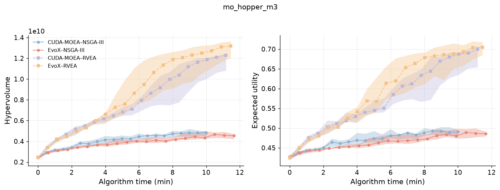
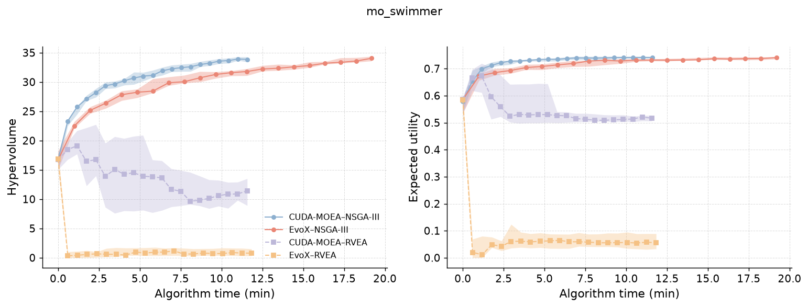

# CUDA-MOEA and EvoX Combined Benchmark Report

English | [简体中文](REPORT.zh-CN.md)

Generated: 2026-07-15  
Scope: DTLZ Groups A/B/C and the completed subset of MoRobtrol Group D  
Detailed reports: [DTLZ](../DTLZ/results/REPORT.md) · [MoRobtrol](../MoRobtrol/results/REPORT.md)

## Executive summary

- CUDA-MOEA was faster in every comparable DTLZ timing configuration. Median
  Group A speedups were 5.79–12.42× for NSGA-III and 12.08–12.73× for RVEA.
  Population scaling reached 271.92× and 247.26× respectively. At nominal
  `N=32768`, EvoX RVEA was OOM in all 10 repeats while CUDA-MOEA completed all
  10.
- No framework dominated DTLZ quality on every problem. CUDA-MOEA had lower
  median IGD on 5/8 NSGA-III problems and 4/8 RVEA problems; after Holm
  correction, its advantage was significant on 2 and 4 problems respectively.
- In the completed MoRobtrol subset, CUDA-MOEA NSGA-III generally had better
  quality per unit algorithm time. RVEA conclusions depended on the environment:
  EvoX was stronger late in Hopper, while CUDA-MOEA was much stronger in
  Swimmer.
- MoRobtrol currently covers only Hopper and Swimmer, not all nine environments
  in the protocol. Its results are preliminary and must not be presented as a
  complete Group D or cross-environment conclusion.

## Scope and interpretation

| Group | Purpose | Completed data | Primary metrics |
| --- | --- | ---: | --- |
| DTLZ A | Quality and baseline timing on 8 problems | 960/960 successful | Final IGD, generation time |
| DTLZ B | Population scaling | 310/320 successful, 10 recorded OOM | Generation time, speedup |
| DTLZ C | Dimension scaling | 440/440 successful | Generation time, speedup |
| MoRobtrol D | Control quality and time efficiency | 2 of 9 planned environments | HV, EU, quality-at-time, time-to-target |

Lower IGD is better; higher HV and EU are better. DTLZ timing covers the
generation loop after initialization. MoRobtrol timing is cumulative checkpoint
algorithm time and includes policy evaluation during optimization, but excludes
post-run independent evaluation, metrics, I/O, and plotting. The two timing
boundaries are not interchangeable.

## DTLZ quality and performance

| Algorithm | CUDA-MOEA lower median IGD | CUDA-MOEA significantly lower | EvoX significantly lower | Not significant |
| --- | ---: | ---: | ---: | ---: |
| NSGA-III | 5/8 | 2/8 | 3/8 | 3/8 |
| RVEA | 4/8 | 4/8 | 3/8 | 1/8 |

For NSGA-III, CUDA-MOEA was significantly better on DTLZ1 and DTLZ4; EvoX was
significantly better on DTLZ5, DTLZ6, and ConvexDTLZ2. For RVEA, CUDA-MOEA was
significantly better on DTLZ1, DTLZ3, DTLZ5, and DTLZ7; EvoX was significantly
better on DTLZ2, DTLZ4, and DTLZ6.

| Scaling study | NSGA-III | RVEA |
| --- | ---: | ---: |
| Group A speedup range | 5.79–12.42× | 12.08–12.73× |
| Group B at smallest nominal population | 5.23× | 12.49× |
| Group B largest comparable point | 271.92× at `N=32768` | 247.26× at `N=16384` |
| Group C minimum | 4.73× at `D=8192` | 7.81× at `D=8192` |
| Group C at `D=131072` | 10.12× | 10.27× |

 

## MoRobtrol completed subset

| Environment / algorithm | CUDA-MOEA final HV / EU | EvoX final HV / EU | Median 100-generation time, CUDA / EvoX | Interpretation |
| --- | ---: | ---: | ---: | --- |
| Hopper / NSGA-III | 4.846e9 / 0.4906 | 4.538e9 / 0.4856 | 9.99 / 11.65 min | CUDA-MOEA higher quality and faster |
| Hopper / RVEA | 1.229e10 / 0.6995 | 1.318e10 / 0.7051 | 11.17 / 11.46 min | EvoX higher late quality; times close |
| Swimmer / NSGA-III | 33.87 / 0.74095 | 34.06 / 0.74092 | 11.59 / 19.19 min | Final quality close; CUDA-MOEA faster |
| Swimmer / RVEA | 11.43 / 0.5163 | 0.7765 / 0.05566 | 11.57 / 11.83 min | CUDA-MOEA much higher quality; times close |

 

Fixed-generation, fixed-time, and fixed-quality-target comparisons answer
different questions. In particular, a zero-minute time-to-target can occur when
the EvoX-derived target is already met at generation 0; it is not infinite
speedup.

## Supported and unsupported conclusions

The recorded evidence supports high DTLZ throughput and scaling for CUDA-MOEA
on the tested NVIDIA RTX PRO 6000 Blackwell configuration. It also shows that
DTLZ quality depends on both problem and algorithm, and that MoRobtrol's shared
simulation cost can reduce end-to-end algorithm-time differences.

The evidence does not support extrapolation to untested GPUs, software stacks,
operating systems, all control environments, or general solution-quality
superiority. Representative fronts illustrate typical median-quality runs; they
do not replace multi-seed statistics.

## Provenance

The DTLZ baseline revision was
`2dc367fda14d5b2860e57ad5d0a6a6e2e7d32088`, using `cuda:1` on an NVIDIA RTX
PRO 6000 Blackwell Workstation Edition with CUDA-MOEA 0.1.0, EvoX 1.3.0, and
PyTorch 2.12.0. Consult the committed CSV files for exact values:

- [DTLZ derived data](../DTLZ/results/data/)
- [MoRobtrol derived data](../MoRobtrol/results/data/)

Figures are explanatory views and should not be digitized as the data source.
